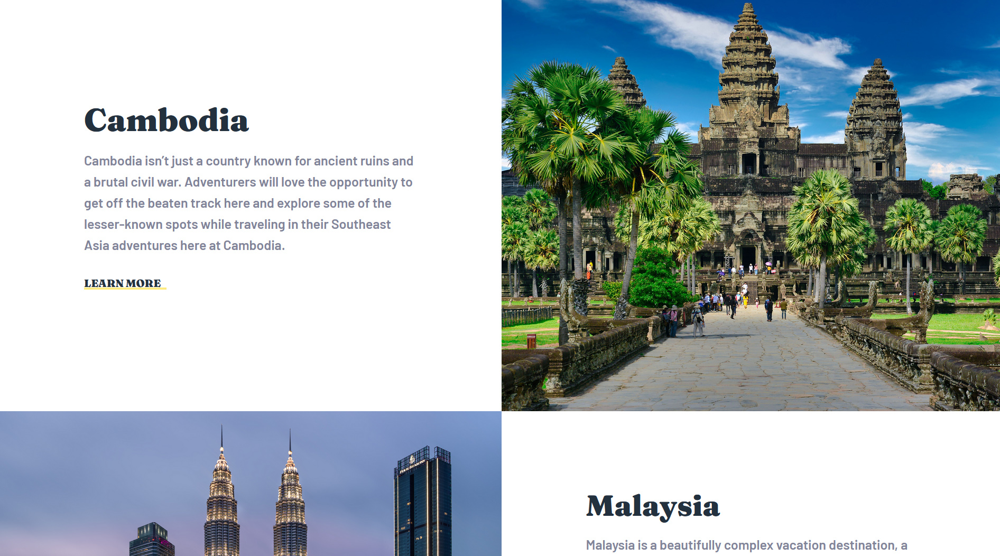

# Weblancers Competition - Seatseek tourist company

## Table of contents

- [Overview](#overview)
  - [The challenge](#the-challenge)
  - [Screenshot](#screenshot)
  - [Links](#links)
- [My process](#my-process)
  - [Built with](#built-with)
  - [What I learned](#what-i-learned)
  - [Useful resources](#useful-resources)
- [Author](#author)

## Overview

### The challenge

Users should be able to:

- View the optimal layout for the app depending on their device's screen size
- See hover states for all interactive elements on the page

### Screenshot

### Links

- [Live Site URL](https://mohsin316.github.io/mohsin_Seatseek/)

## My process

### Built with

- Semantic HTML5 markup
- CSS custom properties
- Flexbox
- CSS Grid
- Mobile-first workflow
- Animations and transitions
- Javascript ham burger menu

### What I learned

This was a very fun and exciting comeptition! I learnt a lot on how much I can do in a short time limit and realised my limits. I had a lot more plans with theis challenge, but due to time constraints I had to make do with what I could. Overall a great experience!

### Useful resources

- [net ninja](https://netninja.dev/courses) - This helped me for Studying javascript. I really liked this course and i highly recommend to begginers.
- [Kevin Powell](https://www.youtube.com/kepowob) - This person is extremely talented and has helped me learn most of the things i know in CSS. highly recommend to anyone who is studying CSS.

## Author

- [My website](https://mohsins-solutions.netlify.app/)
- Twitter - [@Mohsin_316](https://twitter.com/Mohsin_316)
